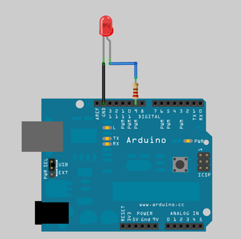
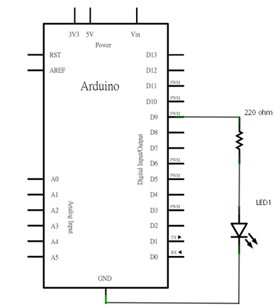
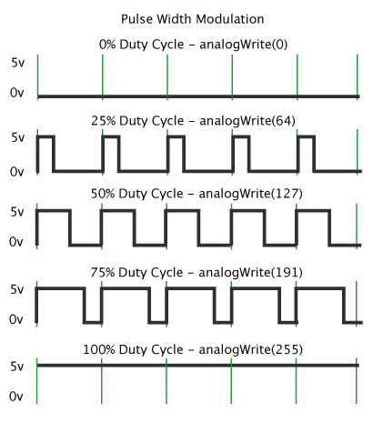

## Arduino入門教學(4) – 控制 LED 燈光亮度 (作者：Copper Maa)

### Arduino 筆記 - Lab3 控制 LED 燈光亮度

#### 實驗目的

利用 PWM (Pulse Width Modulation, 脈衝寬度調變) 控制 LED 燈光亮度。

#### 材料

* Arduino 主板 x 1
* LED x 1
* 220 ohm 電阻 x 1
* 單心線 x N

#### 接線

* LED 接到 pin9 和 GND，長腳(陽極)串接一顆 220 ohm 電阻到 pin9，短腳(陰極)直接接到 GND




#### 電路圖



#### 程式碼：Fading.pde

```CPP
int brightness = 0;    // how bright the LED is
int fadeAmount = 5;    // how many points to fade the LED by

void setup()  { 
  // declare pin 9 to be an output:
  pinMode(9, OUTPUT);
} 

void loop()  { 
  // set the brightness of pin 9:
  analogWrite(9, brightness);    

  // change the brightness for next time through the loop:
  brightness = brightness + fadeAmount;

  // reverse the direction of the fading at the ends of the fade: 
  if (brightness == 0 || brightness == 255) {
    fadeAmount = -fadeAmount ; 
  }     
  // wait for 30 milliseconds to see the dimming effect    
  delay(30);                            
}
```

編譯這支程式，然後上傳到 Arduino 板子上，過數秒後，就會看到 LED 燈光不斷地改變亮度，一下子漸亮，一下漸暗。

說明：

* L01: brightness 變數用來保存目前的燈光亮度
* L02: fadeAmount 變數用來設定每一次燈光亮度的調整值
* L06: 宣告 pin9 為 output pin, LED 接在 pin9 上
* L11: 使用 analogWrite(9, brightness) 設定 pin9 上的 LED 燈光亮度
* L14: 調整下一次的燈光亮度
* L17~L19: 改變 fadeAmount 燈光亮度調整值，假如 brightness 已達到最亮(255)，就將 fadeAmount 改成 -5，讓燈光下一次的變化改成漸漸變暗，假如 brightness 已達到最暗(0)，就將 fadeAmount 改回 +5，讓燈光下一次的變化改成漸漸變亮。
* L21: 延遲 30ms，這樣肉眼才能看得到 LED 調光的效果

#### 範例照片／影片

Youtube 上正好有段示範利用 PWM 控制 LED 燈光亮度的影片，我們來看看他的示範：

* http://youtu.be/752tMDyvbxE

#### PWM 原理簡介

數位輸出可以控制訊號的開跟關，開意味著通電，關意味著斷電，如果我們能夠進一步通電的時間比例，就能讓類比輸出產生變化，例如 LED 燈光通電時間為 50%，就可以控制 LED 讓它只有 50% 的亮度，如果把通電時間比例改為 25%，就可以控制 LED 讓它只有 25% 的亮度。這個方法稱為 PWM (Pulse Width Modulation)脈衝寬度調變，PWM 是一個利用數位訊號來控制類比輸出的技術，常用於蜂鳴器、電熱器、馬達或風扇轉速、燈光亮度等的控制。

下圖中，垂直的綠線代表一個規律的時間週期，在 Arduino 中，每個週期是 2ms (PWM 頻率為 500Hz)。analogWrite() 的參數值範圍介於 0 到 255 之間，analogWrite(255) 代表產生 100% duty cyle 的輸出(一直通電)，而 analogWrite(127) 則是產生 50% duty cycle 的輸出(一半的時間通電，一半的時間斷電)。

Duty Cycle 為每一個週期通電(on) 的時間比例。

數位輸出可以控制訊號的開跟關，開意味著通電，關意味著斷電，如果我們能夠進一步通電的時間比例，就能讓類比輸出產生變化，例如 LED 燈光通電時間為 50%，就可以控制 LED 讓它只有 50% 的亮度，如果把通電時間比例改為 25%，就可以控制 LED 讓它只有 25% 的亮度。這個方法稱為 PWM (Pulse Width Modulation)脈衝寬度調變，PWM 是一個利用數位訊號來控制類比輸出的技術，常用於蜂鳴器、電熱器、馬達或風扇轉速、燈光亮度等的控制。

下圖中，垂直的綠線代表一個規律的時間週期，在 Arduino 中，每個週期是 2ms (PWM 頻率為 500Hz)。analogWrite() 的參數值範圍介於 0 到 255 之間，analogWrite(255) 代表產生 100% duty cyle 的輸出(一直通電)，而 analogWrite(127) 則是產生 50% duty cycle 的輸出(一半的時間通電，一半的時間斷電)。

Duty Cycle 為每一個週期通電(on) 的時間比例。



你可能會納悶，一直開開關關的 ，LED 會不會閃爍讓眼睛不舒服？答案是不會的，因為開關的頻率很快，肉眼是看不出 LED 有在閃爍的。

#### 動動腦

1. 如何加快或放慢 LED 亮度變化的速度？(提示：delay() 函式)
2. 改用 pin9 以外的其它 PWM 腳位
3. 多接幾顆 LED，讓每顆 LED 使用不同的速率改變亮度

#### 參考資料

* <http://arduino.cc/en/Tutorial/PWM>

### Arduino 筆記 - Lab4 使用可變電阻調光

#### 實驗目的

使用可變電阻 (potentiometer) 控制 LED 的燈光亮度，達到調光的目的。 

#### 材料

* 麵包板 x 1
* Arduino 主板 x 1
* LED x 1
* 220 ohm 電阻 x 1
* 可變電阻 x 1
* 單心線 x N

#### 接線

LED 接到 pin9 和 GND，長腳(陽極)串接一顆 220 ohm 電阻到 pin9，短腳(陰極)直接接到 GND
可變電阻中間腳位接到類比輸入(Analog Input) pin3，剩下的兩支腳位，一支接到 5V，另外一支接到 GND
 


#### 電路圖


#### 程式碼：potentiometer.pde

```CPP

int potPin = 3; // select the input pin for the potentiometer
int ledPin = 9; // select the pin for the LED

void setup() {
  Serial.begin(9600);
}

void loop() {
  int sensorValue = analogRead(potPin);
  Serial.println(sensorValue, DEC);
  
  sensorValue = sensorValue/4; // convert from 0-1024 to 0-255
  analogWrite(ledPin, sensorValue);
  delay(150);
}

```

#### 說明： 

* L01: 宣告可變電阻所用的類比輸入腳位
* L02: 宣告 LED 燈號腳位
* L05: 設定 SerialPort 的傳輸速率，鮑率為 9600 bps (bit per second)
* L09: 讀取可變電阻讀值並且放到 sensorValue 變數裏
* L10: 使用 Serial.println(sensorValue, DEC) 把電阻值列印到 SerialPort。DEC 代表以十進位顯示數字
* L12: analogRead() 讀進來的是一個 10 位元的數值，值域為 0 到 1023，由於 analogWrite() 的參數只能接受 0 到 255 的數值，所以得將 sensorValue 除以 4，讓 sensorValue 的數值從 0-1023 等比例縮小到 0-255 的範圍。


#### 範例照片/影片

編譯好程式，上傳到 Arduino 後，按下 Serial Monitor  這個按鈕，就會看到 COM Port 不斷收到一串範圍介於 0 到 1023 的數值，這些數值與可變電阻是相關聯的。如果旋轉可變電阻，對應的數值也會跟著改變，而且 LED 燈號的亮度也會跟著改變。 
 
Youtube 上正好有段示範利用可變電阻控制 LED 燈光亮度的影片，我們來看看他的示範： 

* Arduino PWM diode dimmer -- <http://youtu.be/Ivf-PfZUymo>

