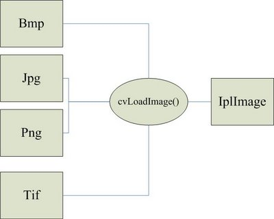
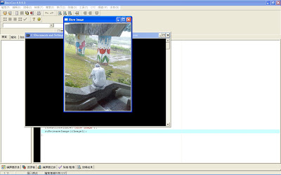
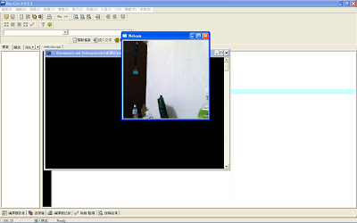

## OpenCV 程式設計介紹

* [OpenCV] Dev-C++ 4.9.9.2 安裝 OpenCV 2.0
    * http://cg2010studio.wordpress.com/2011/03/31/opencv-dev-c-4-9-9-2-%E5%AE%89%E8%A3%9D-opencv-2-0/
* Windows、Cygwin、Linux系統下Cmake的安裝與使用
    * http://eportfolio.lib.ksu.edu.tw/~4970E033/blog?node=000100021

### 簡介

OpenCV (Open Source Computer Vision) 是由 Intel 公司所開發出來的 Open Source 圖形演算法的函式庫(Image Process Libary) 可以製做圖片，視訊，矩陣運算，統計，圖論，資料儲存的相關C語言程式設計，相關的領域為：「影像處理，電腦視覺，圖形識別，電腦圖學，資訊檢索或遊戲設計」等。比較有名的製作為「物體追蹤，人臉辨識，傅立葉轉換，紋理分析」， 可以整合不同圖檔格式的矩陣運算，應用在靜態圖片(BMP, JPG, TIF, PNG),動態 Webcam 的影像處理。

OpenCV 的組成為許多圖形處理的資料結構及演算法所疊合而成，因此需要一些基本的資料結構基礎，比如說 struct 怎麼使用, 如何 release 資料結構的空間等基本操作，會使用到 linked list 的算少數， 算是C語言中級程式設計， 有興趣玩的話，國內影像處理領域相關論文演算法幾乎都可以在OpenCV找的到， 方便學術界用 C 語言推演更進階的影像處理演算法，功能好比Matlab， 但比Matlab快上許多倍，更可以整合c語言相關函式庫，做更多元強大的功能應用， 然而它最大的門檻是比 Matlab 的進入障礙還高一些， 運用到許多資料結構， 指標運算， 記憶體位址， 學完OpenCV， 相信程式設計的功力更可以技高一籌。

OpenCV提供了簡單的GUI介面，他無法像 MicroSoft Visual C++ 的 MFC 及 Borland C++builder 的 VCL 那麼完整，但如果是對於學術領域的研究是夠用的，他也可以整合在 Visual C++ 及 C++ builder 的環境上，而本人是以 Dev - C++ 為主， 屬於最基本簡單又不須付費的 Complier。

### 安裝開發環境

Dev-C++ 使用 OpenCV 的方法 

1. 在工具->編譯器選項->編譯器->在連結器命令列中加入以下命令 -lhighgui -lcv -lcxcore -lcvaux -lcvcam
2. 工具->編譯器選項->目錄->函式庫加入OpenCV的lib資料夾路 C:\Program Files\OpenCV\lib
3. 工具->編譯器選項->目錄->C引入檔(include) 
    * C:\Program Files\OpenCV\cxcore\include
    * C:\Program Files\OpenCV\cv\include
    * C:\Program Files\OpenCV\otherlibs\highgui
    * C:\Program Files\OpenCV\cvaux\include
    * C:\Program Files\OpenCV\otherlibs\cvcam\include
4. 工具->編譯器選項->目錄->C++引入檔(include)
    * C:\Program Files\OpenCV\cxcore\include
    * C:\Program Files\OpenCV\cv\include
    * C:\Program Files\OpenCV\otherlibs\highgui
    * C:\Program Files\OpenCV\cvaux\include
    * C:\Program Files\OpenCV\otherlibs\cvcam\include

    
### OpenCV 的程式結構

接下來進入OpenCV最基礎的入門， OpenCV最常用的函式庫為 "cv.h"， "highgui.h"， "cxcore.h" 及 "cvaux.h.h"， "cv.h" 代表 Computer Vision，電腦視覺函式庫， "highgui.h"， 當然就是GUI介面的函式庫啦，當路徑都設定好之後(第一篇安裝方法)，直接在開頭 include 進去就好啦，就跟 stdio.h 的使用方法一樣。

```CPP
#include <stdio.h>
#include <cv.h>
#include <highgui.h>
#include <cxcore.h>
#include <cvaux.h>
```

接著，就介紹最基本的資料結構 -- IplImage， 此資料結構是所有圖檔的一個中介， 圖檔格式有很多種(bmp,jpg,png,tif)， 此資料結構的內容既不是 bmp， 也不是 jpg， 而是一個藉由 cvLoadImage() 所轉換的自定義格式如下所示：



讀入圖片之後，要怎麼知道圖片真的讀入了呢，就利用 "highgui.h" 的功能來檢視看看吧。

```CPP
cvNamedWindow("Show Image", 0); 
cvResizeWindow("Show Image", 300, 400); 
cvShowImage("Show Image", Image1);
```

要使用OpenCV的GUI時，要先給視窗名稱命名，這算是比較好寫的 GUI 之一了，裡面 "Show Image" 就是這個視窗的名稱， cvResizeWindow() 就是調整視窗大小， 視窗大小被設定在300*400， 並指定視窗的名稱，再來， 就是顯示視窗的圖片cvShowImage()， 並且給予IplImage資料結構的結構變數， Image1 裡面必須要先用 cvLoadImage() 存入圖檔， 接著，再用鍵盤事件cvWaitKey(0)來做阻斷， 一張圖片就可以被開啟啦， 這是OpenCV最基本的操作之一， 也像是c語言的"hello world"的開始，恭喜跨入第一步。

當資料結構被創立之後，當然要做回收的動作啦，在這邊 IplImage 的資料結構被創立，視窗介面的資料結構也被創立，當執行完就要做回收的動作啦，所有的資料結構都會被 malloc() 的副程式配置空間，而 cvLoadImage() 只是把一連串的動作隱藏起來， cvLoadImage() 不但做了配置 IplImage 的資料結構空間，也把所有副檔名格式的資料初始化， 將所有的數值及一些簡單的分析都存在 IplImage 的資料結構內，方便做一些圖形演算法的運算，而視窗介面被 cvNamedWindow() 給創立，視窗的資料結構被隱含在cvNamedWindow() 中，使用者只要使用 "Show Image" 等命名操控就可以使用GUI視窗的控制， 這是一種分層抽象的概念，比較複雜的部份被程式碼包再它的下一層， 因此， 我只要操控該視窗的字串名稱("Show Image") 就可以做任何想要的動作了。

這邊用cvDestroyWindow()及cvReleaseImage()回收給系統， 回收的東西是記憶體，一般來說， 不做記憶體回收也不會影響電腦的效能太大， 作業系統也會自動的做垃圾收集， 把一些沒意義的記憶體做刪除， 因此程式碼不多這兩行也不會有太大的影響， 不過這種東西畢竟是卡記憶體的， 也不能確定它是不是永久卡位 (電腦關機後一定消失)， 因此，養成良好的習慣是程式設計師必備的， 尤其是再做一個大的應用程式的時候。

### 簡單的 OpenCV 讀取圖形檔案程式碼

```CPP
#include <stdio.h>
#include <cv.h>
#include <highgui.h> 

int main()
{
    char FileName[10]="rain.jpg";
    
    IplImage *Image1 = cvLoadImage(FileName,1);
    
    cvNamedWindow("Show Image",0);

    cvResizeWindow("Show Image",300,400);

    cvShowImage("Show Image",Image1);

    cvWaitKey(0); 

    cvDestroyWindow("Show Image");

    cvReleaseImage(&Image1);
}
```

圖片：


執行結果：




### OpenCV WebCam 抓取視訊

視訊的使用也是OpenCV的基本功能之一，它可以做連續性的影像處理，比capCreateCaptureWindow()這個函式好用多了，capCreateCaptureWindow() 在"vfw.h" 裡,只能在MicroSoft 的 Visual C++及 Borland C++ builder 使用，Dev-C++4.9.9.2 不提供此函式，當然啦，OpenCV對於視訊的處理提供了比capCreateCaptureWindow() 更強大的功能。

程式碼部份

```CPP
#include <cv.h>
#include <highgui.h>
#include <stdio.h>

int main()
{
    CvCapture *capture;
    IplImage *frame;
    capture =cvCaptureFromCAM(0) ;
    cvNamedWindow("Webcam",0);
    while(true)
    {
        frame = cvQueryFrame(capture);
        cvShowImage("Webcam",frame);
        if(cvWaitKey(10)>=0)
        {
              break;
        }
    }
    cvReleaseCapture(&capture);
    cvDestroyWindow("Webcam");
}
```

裡面使用到 CvCapture 及 IplImage 兩個資料結構，CvCapture是一個 Interface 的資料結構，為一個資料結構的雛形，無任何的變數型別存在，由 cvCaptureFromCAM(0) 來選定 Webcam 裝置， cvCaptureFromCAM(0) 的0代表自動偵測視訊裝置，如果有兩台以上的 Webcam 則就用連續兩個 cvCaptureFromCAM(0) 函式來擷取，接著，就用 while(true) 的無窮回圈來捕捉連續影像的圖形畫面，cvQueryFrame() 則用來擷取每秒顯示出來的frame這裡由 cvWaitKey(10) 來控制擷取時間，每延遲 10 毫秒捕捉一次視訊畫面，cvWaitKey() 為鍵盤事件，每超過10毫秒則會回傳-1，因此，畫面會因 cvWaitKey(10) 而延遲 10 毫秒，接著由無窮回圈來繼續播放，當鍵盤事件發生的時候則會跳出whlie的無窮回圈。接著就把 CvCapture 資料結構及視窗介面資料結構做記憶體的釋放。


執行結果:




### 參考文獻
* http://www.laganiere.name/opencvCookbook/chap1.shtml