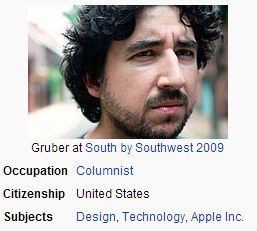

## 出版短訊-Markdown 寫作格式

[Markdown] 是一種由 [John Gruber] 和 [Aaron Swartz](http://zh.wikipedia.org/wiki/Aaron_Swartz) 
所創造的超簡單型標記語言，目前在網路越來越多的人使用這種格式進行寫作，其用途有點像維基百科
所使用的 mediawiki 格式，但是設計理念卻有很大的不同。

John Gruber                      Aaron Swartz
----------------------------     -------------------------------
       

[Markdown] 的設計理念有點像文書排版軟體 (例如 MS. Word, LibreOffice Writer) 這種「所視即所得」的想法，但卻是純文字形式的寫法，也就是讓你寫出來的文字檔就與呈現時的畫面
差不多，這樣的設計讓您在寫作時就很容易感受排版出來的結果，這種作法正是 [Markdown] 令人愛不釋手
的原因。

為了讓讀者 *實際體會* Markdown 的所視即所得效果，我們將本文的部分原始碼列於此處，這樣讀者應該
就可以很容易的透過對照看出這些標記的效果了 

```
## 出版短訊：markdown 寫作格式

[Markdown] 是一種由 [John Gruber] 和 
[Aaron Swartz](http://zh.wikipedia.org/wiki/Aaron_Swartz)
所創造的超簡單型標記語言，目前在網路越來越多的人
使用這種格式進行寫作，其用途有點像維基百科
所使用的 mediawiki 格式，但是設計理念卻有很大的不同。

John Gruber                      Aaron Swartz
----------------------------     -------------------------------
       

...

為了讓讀者 *實際體會* Markdown 的所視即所得效果，
我們將本文的原始碼列於此處，這樣讀者應該就可
以很容易的透過對照看出這些標記的效果了。

...

如果您想要進一步瞭解 markdown 的語法，
請參考 <http://markdown.tw/> 這個寫得很好的 markdown 語法介紹。

[John Gruber]:http://en.wikipedia.org/wiki/John_Gruber
[Markdown]:http://zh.wikipedia.org/wiki/Markdown
```

如果您想要進一步瞭解 markdown 的語法，請參考 <http://markdown.tw/> 這個寫得很好的 markdown 語法介紹。

[John Gruber]:http://en.wikipedia.org/wiki/John_Gruber
[Markdown]:http://zh.wikipedia.org/wiki/Markdown

說明：必須注意的是，Markdown 當中並沒有設計表格的語法，所以本文中的表格語法是 pandoc 軟體採用
「所視即所得」精神所自行延伸的語法。

(本文由陳鍾誠修改自維基百科，來源為 <http://zh.wikipedia.org/wiki/Markdown>)


