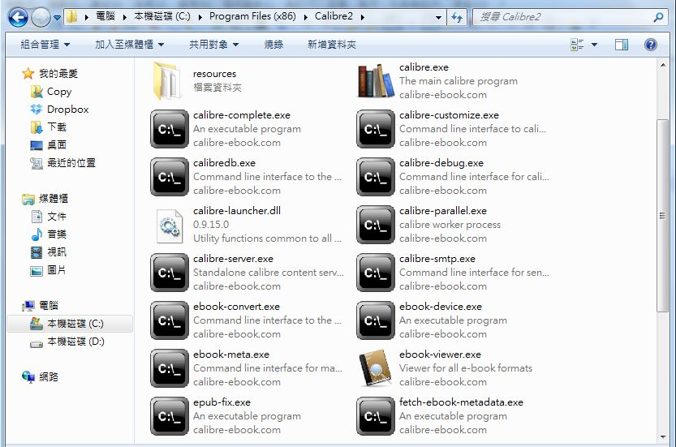

## 軟體短訊-Calibre 電子書管理轉換系統

Calibre 是一個用來管理並且轉換電子書格式的系統，您可以匯入電子書到 Calibre 當中進行管理與閱讀，
也可以將電子書轉換成其他格式，以便放到某些平台上去閱讀。

Calibre 具有視窗型的介面，但是筆者並不常使用，筆者較常用的是 Calibre 當中所附的一個命令列程式，
稱為 ebook-convert，下圖顯示了筆者電腦中這個程式所在的位置。

Ebook-convert 可以將電子書的格式轉來轉去，例如將 epub 轉換為 pdf 檔案輸出，以下是該程式支援的
輸出入檔案格式：

> Input Formats:  CBZ, CBR, CBC, CHM, DJVU, EPUB, FB2, HTML, HTMLZ, LIT, LRF, MOBI, ODT, 
>                 PDF, PRC, PDB, PML, RB, RTF, SNB, TCR, TXT, TXTZ
> 
> Output Formats: AZW3, EPUB, FB2, OEB, LIT, LRF, MOBI, HTMLZ, PDB, PML, RB, PDF, RTF, SNB, 
>                 TCR, TXT, TXTZ

您可以看到 ebook-convert 所支援的電子書格式真的非常完整，請進一步閱讀以下網頁以瞭解其用法。

* <http://manual.calibre-ebook.com/cli/ebook-convert.html>

事實上、程式人雜誌自從第二期之後，就是使用 pandoc 將 markdown 轉換為 html 與 epub 格式，然後
再用 Calibre 的 ebook-convert 程式，將 epub 電子書轉換為 PDF 格式，以便讓讀者能方便的閱讀。

或許有些曾經用過 pandoc 的讀者會有疑問，為何不用 pandoc 直接將 markdown 轉換為 pdf 呢？

原本、筆者曾經這樣做過，但是這樣作在英文上沒有問題，但在中文上就無法成功轉換了。為了解決 pandoc 
中文轉換的問題，筆者也曾經撰寫過 latex 樣版，讓 pandoc 順利的將 markdown 轉換為 latex 之後再用
MiKTeX 將 latex 轉換為 pdf 文件。雖然最後可以運作，但是仍然有些無法令人滿意的問題，所以後來
筆者才找到了 Calibre 中的  ebook-convert，來完成 epub 轉為 pdf 的動作。

Calibre 官方網站的網址為 <http://calibre-ebook.com/> ，您可以從網站中取得進一步的資訊。【本文由陳鍾誠撰寫】

